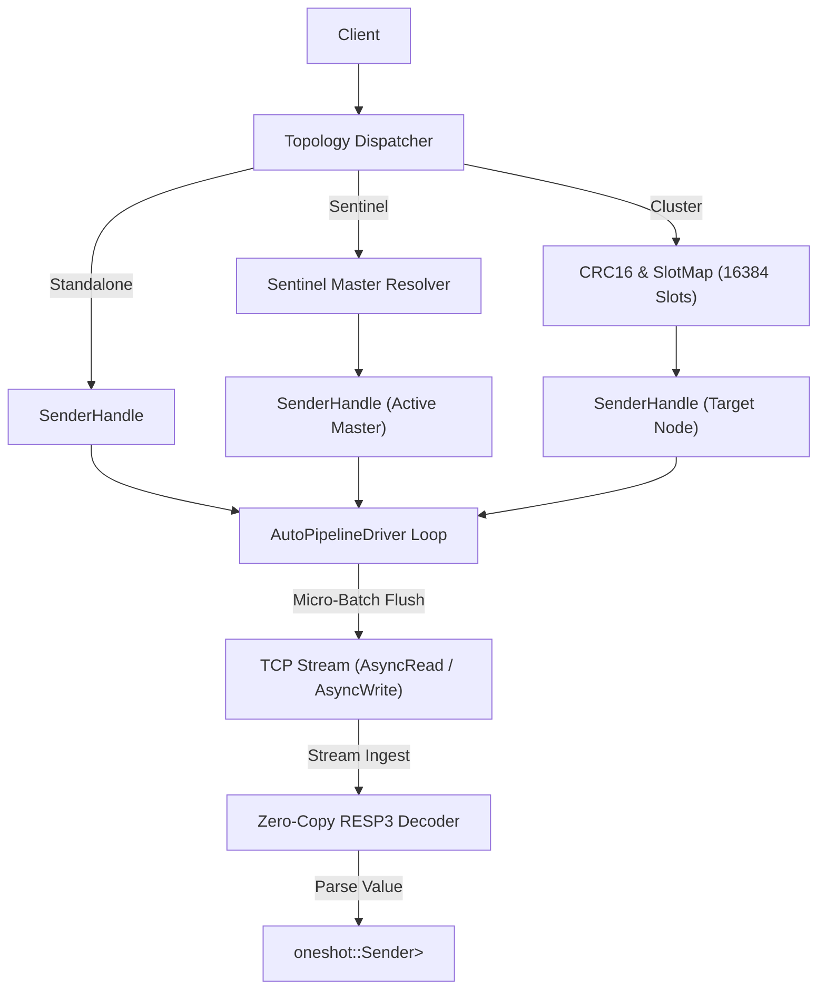

# kvrocks : Fast Async RESP3 Client for Redis & Apache Kvrocks

## Project Overview

`kvrocks` is a high-performance, asynchronous Redis and Apache Kvrocks client for Rust. Built from the ground up for modern async runtimes, it delivers native RESP3 wire protocol support, transparent request auto-pipelining, dynamic cluster slot routing with MOVED/ASK handling, Sentinel automatic failover resolution, and native support for Apache Kvrocks extensions.

## Features

- Native RESP3 protocol encoder and streaming zero-copy decoder.
- High-throughput auto-pipelining driver merging concurrent command dispatches into batch socket operations without user-side batch management.
- Multi-topology compatibility: Standalone, Redis Sentinel with dynamic master resolution, and Redis/Kvrocks Cluster with slot caching and redirect handling.
- Rich command coverage: Standard Redis data structures (String, Hash, List, Set, Sorted Set, Streams, Geo, Bitmaps, HyperLogLog, Pub/Sub, Transactions, Scripts/Functions) and Kvrocks extensions (CAS, CAD, DELEX, MSETEX, SortedInt, TDigest, Search, JSON, Bloom).
- Zero-copy parsing with minimal allocations via `bytes`, `itoa`, `ryu`, and `memchr`.
- Cross-platform architecture ready for native environments and WebAssembly compilation.

## Usage

### Standalone Connection

```rust
use kvrocks::{Config, Server, ServerConfig, client};

#[tokio::main]
async fn main() -> Result<(), Box<dyn std::error::Error>> {
  let conf = Config {
    server: Some(ServerConfig::Centralized {
      server: Server::new("127.0.0.1", 6379),
    }),
    username: None,
    password: Some("secret_pass".into()),
    database: Some(0),
  };

  let cli = client(conf).await?;

  // String operations
  cli.set("key", "value", &[]).await?;
  let val: Option<String> = cli.get("key").await?;
  println!("get key: {:?}", val);

  Ok(())
}
```

### Loading Configuration from Environment Variables

```rust
use kvrocks::conn;

// Reads MYAPP_REDIS, MYAPP_SENTINEL, MYAPP_CLUSTER, MYAPP_USER, MYAPP_PASS, MYAPP_DB
#[tokio::main]
async fn main() -> Result<(), Box<dyn std::error::Error>> {
  let cli = conn("MYAPP").await?;
  let pong = cli.ping(None).await?;
  println!("{pong}");
  Ok(())
}
```

### Working with Data Structures

```rust
use rapidhash::RapidHashMap as HashMap;
use kvrocks::{Config, client};

#[tokio::main]
async fn main() -> Result<(), Box<dyn std::error::Error>> {
  let cli = client(Config::default()).await?;

  // Hash
  cli.hset("user:100", "name", "alice").await?;
  cli.hmset("user:100", &[("role", "admin"), ("status", "active")]).await?;
  let user_info: HashMap<String, String> = cli.hgetall("user:100").await?;

  // List
  cli.rpush("queue", &["job1", "job2"]).await?;
  let job: Option<String> = cli.lpop("queue").await?;

  // Set
  cli.sadd("tags", &["rust", "database", "cache"]).await?;
  let is_member = cli.sismember("tags", "rust").await?;

  // Sorted Set
  cli.zadd("leaderboard", &[(100.0, "player1"), (200.0, "player2")]).await?;
  let top: Vec<String> = cli.zrange("leaderboard", 0, -1).await?;

  Ok(())
}
```

### Apache Kvrocks Specialized Commands

```rust
use kvrocks::{Config, client};

#[tokio::main]
async fn main() -> Result<(), Box<dyn std::error::Error>> {
  let cli = client(Config::default()).await?;

  // Compare And Set / Compare And Delete
  cli.set("lock_key", "version_1", &[]).await?;
  let updated = cli.cas("lock_key", "version_1", "version_2", Some(30)).await?;
  let deleted = cli.cad("lock_key", "version_2").await?;

  // SortedInt (Kvrocks specific memory-efficient integer set)
  cli.siadd("id_set", &[1001, 1002, 1003]).await?;
  let exists = cli.siexists("id_set", 1002).await?;
  let ids = cli.sirange("id_set", 0, 10, &[]).await?;

  Ok(())
}
```

### Sentinel & Cluster Topologies

```rust
use kvrocks::{Config, Server, ServerConfig, client};

#[tokio::main]
async fn main() -> Result<(), Box<dyn std::error::Error>> {
  // Sentinel Topology
  let sentinel_conf = Config {
    server: Some(ServerConfig::Sentinel {
      service_name: "mymaster".into(),
      hosts: vec![Server::new("127.0.0.1", 26379)],
      username: None,
      password: Some("sentinel_pass".into()),
    }),
    username: None,
    password: Some("master_pass".into()),
    database: None,
  };
  let sentinel_cli = client(sentinel_conf).await?;

  // Cluster Topology
  let cluster_conf = Config {
    server: Some(ServerConfig::Cluster {
      nodes: vec![
        Server::new("127.0.0.1", 7000),
        Server::new("127.0.0.1", 7001),
      ],
    }),
    username: None,
    password: None,
    database: None,
  };
  let cluster_cli = client(cluster_conf).await?;

  Ok(())
}
```

## Architecture & Design

### Call Flow & Request Pipeline



### Auto-Pipelining Mechanism

1. Concurrent caller tasks send `Request { cmd, responder }` over unbounded channels to `AutoPipelineDriver`.
2. The driver encodes queued commands in micro-batches directly into memory write buffers and flushes them across the network in single system calls.
3. Simultaneously, incoming stream buffers are parsed via `Decoder::decode`. Completed responses are dispatched back to waiting caller tasks through individual `oneshot` response channels.
4. On `MOVED` or `ASK` redirection, cluster slot tables update automatically and reroute transparently.

## Tech Stack

- **Async Runtime**: `tokio` (I/O, synchronization, channels)
- **Buffer & Parsing**: `bytes`, `memchr`
- **Fast Formatting**: `itoa`, `ryu`
- **Hashing**: `crc` (CRC-16 XMODEM for Redis cluster slots)
- **JSON Serialization**: `serde`, `sonic-rs`

## Directory Structure

```
.
├── Cargo.toml
├── README.mdt
├── docker/
│   ├── cluster/
│   ├── sentinel/
│   └── standalone/
├── readme/
│   ├── en.md
│   └── zh.md
├── src/
│   ├── client/
│   │   ├── bit.rs
│   │   ├── bloom.rs
│   │   ├── cluster.rs
│   │   ├── conf.rs
│   │   ├── geo.rs
│   │   ├── hash.rs
│   │   ├── hll.rs
│   │   ├── json.rs
│   │   ├── key.rs
│   │   ├── list.rs
│   │   ├── mod.rs
│   │   ├── pubsub.rs
│   │   ├── replication.rs
│   │   ├── script.rs
│   │   ├── search.rs
│   │   ├── server.rs
│   │   ├── set.rs
│   │   ├── sortedint.rs
│   │   ├── stream.rs
│   │   ├── string.rs
│   │   ├── tdigest.rs
│   │   ├── timeseries.rs
│   │   ├── txn.rs
│   │   └── zset.rs
│   ├── cluster/
│   │   ├── crc16.rs
│   │   ├── mod.rs
│   │   └── slots.rs
│   ├── connection/
│   │   ├── auto_pipeline.rs
│   │   ├── conn.rs
│   │   ├── mod.rs
│   │   └── transport.rs
│   ├── resp3/
│   │   ├── decoder.rs
│   │   ├── encoder.rs
│   │   ├── mod.rs
│   │   └── types.rs
│   ├── sentinel/
│   │   └── mod.rs
│   ├── error.rs
│   └── lib.rs
└── tests/
    ├── test_auto_pipeline.rs
    ├── test_cluster.rs
    ├── test_commands.rs
    ├── test_real.rs
    └── test_resp3.rs
```

## API Reference

### Core Types & Enums

- **`Client`**: Primary client handle containing thread-safe connection state (`Arc<Inner>`). Clones cheaply across tasks and provides async command methods.
- **`Config`**: Client configuration struct holding server topology options, credentials, and database selection.
- **`ServerConfig`**: Topology configuration enum (`Centralized`, `Sentinel`, `Cluster`).
- **`Server`**: Host and port endpoint definition (`host: String`, `port: u16`).
- **`SlotMap`**: Thread-safe Redis cluster slot routing table mapping 16,384 slots to target node addresses.
- **`Cmd`**: RESP command encoder builder with zero-allocation arguments serialization.
- **`Value`**: RESP3 protocol value variant representing strings, integers, floats, booleans, nulls, arrays, sets, maps, push notifications, and errors.
- **`FromValue`**: Type conversion trait mapping raw RESP3 `Value` trees into standard Rust data types and collections.
- **`Decoder`**: Incremental zero-copy parser converting byte streams into RESP3 values.
- **`SentinelConfig`**: Redis Sentinel monitor service configuration.
- **`SentinelManager`**: Sentinel failover coordinator querying active master addresses across sentinel clusters.
- **`Error`**: Comprehensive error enum handling I/O, protocol mismatches, cluster redirections (`Moved`, `Ask`), timeouts, and authentication failures.
- **`Result<T>`**: Type alias for `Result<T, Error>`.

### Exported Functions

- **`client(conf: Config) -> Result<Client>`**: Connects and initializes client with provided configuration.
- **`client_from_env(prefix: impl AsRef<str>) -> Result<Client>`**: Loads configuration from prefixed environment variables and establishes connection.
- **`conn(prefix: impl AsRef<str>) -> Result<Client>`**: Alias for `client_from_env`.
- **`connect(server, username, password, database) -> Result<Client>`**: Connects directly with explicit parameters.
- **`client_lazy(conf: Config) -> Client`**: Constructs client without immediate connection handshake.
- **`lazy_from_env(prefix: impl AsRef<str>) -> Client`**: Constructs client from environment variables lazily.
- **`conf_from_env(prefix: impl AsRef<str>) -> Config`**: Parses environment variables into `Config`.
- **`server_li(host_port: impl AsRef<str>, default_port: u16) -> Vec<Server>`**: Parses whitespace-delimited host:port strings into server lists.
- **`crc16(buf: &[u8]) -> u16`**: Computes CRC16 XMODEM checksum for Redis cluster hashing.
- **`hash_tag(key: &[u8]) -> &[u8]`**: Extracts `{...}` hash tags from keys.
- **`slot(key: &[u8]) -> u16`**: Computes cluster slot index (0..16383) for keys.

## Historical Background & Trivia

### The Evolution from Redis to Apache Kvrocks

Redis revolutionized caching and fast in-memory key-value processing when Salvatore Sanfilippo (antirez) created it in 2009. However, as dataset scales surged into terabytes and petabytes, maintaining pure in-memory storage became cost-prohibitive.

Engineers in large-scale infrastructure environments encountered memory hardware limits and high RAM costs. To solve this, Apache Kvrocks emerged in 2019, inspired by RocksDB-backed key-value research. By mapping rich Redis data structures (Strings, Hashes, Lists, Sets, Sorted Sets) to RocksDB LSM-tree Column Families on NVMe SSDs, Kvrocks reduced infrastructure storage costs by over 80% while retaining full Redis protocol compatibility. Kvrocks entered the Apache Incubator and graduated as an Apache Top-Level Project in June 2023.

### The Shift to RESP3

Redis 6.0 introduced the RESP3 protocol to overcome limitations in RESP2. Where RESP2 flattened complex data structures into generic arrays and bulk strings requiring client-side heuristics, RESP3 introduces first-class protocol data types: true Maps, Sets, Booleans, Doubles, Bignums, Verbatim strings, and Out-of-band Push notifications. This crate delivers first-class RESP3 stream decoding and structured type conversion.
