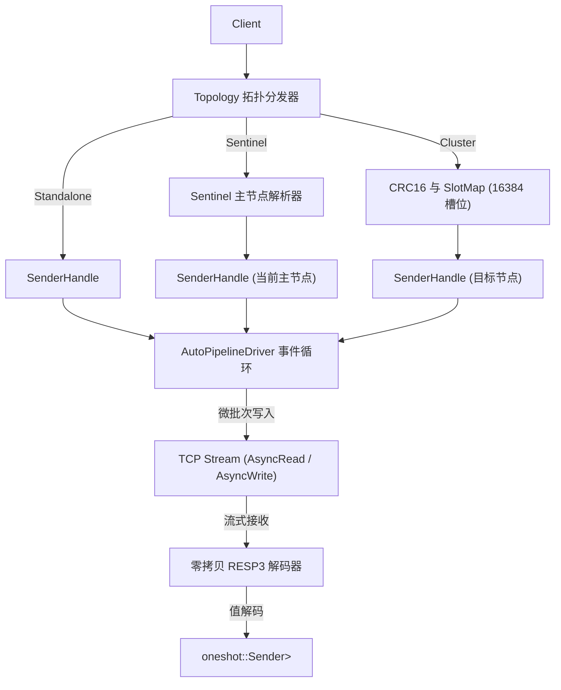

# kvrocks : 高性能异步 RESP3 Redis 与 Apache Kvrocks 客户端

## 项目功能介绍

`kvrocks` 是专为 Rust 异步生态设计的高性能 Redis 与 Apache Kvrocks 客户端。基于 RESP3 协议构建，具备透明化请求自动流水线（Auto-Pipelining）、动态集群槽位路由与重定向处理（MOVED / ASK）、哨兵（Sentinel）故障转移自动主节点解析，以及对 Apache Kvrocks 专有指令的深度支持。

## 特性介绍

- 原生 RESP3 协议编码器与流式零拷贝解码器。
- 高吞吐自动微批流水线驱动，无须用户手动拼接批处理即可自动合并并发网络请求。
- 多拓扑无缝切换：单机模式、Sentinel 哨兵自动监控与主节点故障转移、Cluster 集群槽位自动缓存与请求重定向。
- 全面数据结构覆盖：原生支持 String、Hash、List、Set、ZSet、Stream、Geo、Bitmap、HyperLogLog、Pub/Sub、Transaction、Script / Function，以及 Apache Kvrocks 专有指令（CAS、CAD、DELEX、MSETEX、SortedInt、TDigest、Search、JSON、Bloom）。
- 零拷贝内存解析，依托 `bytes`、`itoa`、`ryu` 与 `memchr` 实现极低内存开销。
- 跨平台架构设计，支持原生系统及 WebAssembly 编译目标。

## 使用演示

### 单机模式连接

```rust
use kvrocks::{Config, Server, ServerConfig, client};

#[tokio::main]
async fn main() -> Result<(), Box<dyn std::error::Error>> {
  let conf = Config {
    server: Some(ServerConfig::Centralized {
      server: Server::new("127.0.0.1", 6379),
    }),
    username: None,
    password: Some("secret_pass".into()),
    database: Some(0),
  };

  let cli = client(conf).await?;

  // 基础 String 操作
  cli.set("key", "value", &[]).await?;
  let val: Option<String> = cli.get("key").await?;
  println!("get key: {:?}", val);

  Ok(())
}
```

### 环境变量加载配置

```rust
use kvrocks::conn;

// 自动读取 MYAPP_REDIS, MYAPP_SENTINEL, MYAPP_CLUSTER, MYAPP_USER, MYAPP_PASS, MYAPP_DB
#[tokio::main]
async fn main() -> Result<(), Box<dyn std::error::Error>> {
  let cli = conn("MYAPP").await?;
  let pong = cli.ping(None).await?;
  println!("{pong}");
  Ok(())
}
```

### 常用数据结构操作

```rust
use rapidhash::RapidHashMap as HashMap;
use kvrocks::{Config, client};

#[tokio::main]
async fn main() -> Result<(), Box<dyn std::error::Error>> {
  let cli = client(Config::default()).await?;

  // Hash 字典
  cli.hset("user:100", "name", "alice").await?;
  cli.hmset("user:100", &[("role", "admin"), ("status", "active")]).await?;
  let user_info: HashMap<String, String> = cli.hgetall("user:100").await?;

  // List 列表
  cli.rpush("queue", &["job1", "job2"]).await?;
  let job: Option<String> = cli.lpop("queue").await?;

  // Set 集合
  cli.sadd("tags", &["rust", "database", "cache"]).await?;
  let is_member = cli.sismember("tags", "rust").await?;

  // ZSet 有序集合
  cli.zadd("leaderboard", &[(100.0, "player1"), (200.0, "player2")]).await?;
  let top: Vec<String> = cli.zrange("leaderboard", 0, -1).await?;

  Ok(())
}
```

### Apache Kvrocks 专有指令

```rust
use kvrocks::{Config, client};

#[tokio::main]
async fn main() -> Result<(), Box<dyn std::error::Error>> {
  let cli = client(Config::default()).await?;

  // CAS (Compare And Set) 与 CAD (Compare And Delete)
  cli.set("lock_key", "version_1", &[]).await?;
  let updated = cli.cas("lock_key", "version_1", "version_2", Some(30)).await?;
  let deleted = cli.cad("lock_key", "version_2").await?;

  // SortedInt (Kvrocks 紧凑有序整数集)
  cli.siadd("id_set", &[1001, 1002, 1003]).await?;
  let exists = cli.siexists("id_set", 1002).await?;
  let ids = cli.sirange("id_set", 0, 10, &[]).await?;

  Ok(())
}
```

### 哨兵与集群拓扑配置

```rust
use kvrocks::{Config, Server, ServerConfig, client};

#[tokio::main]
async fn main() -> Result<(), Box<dyn std::error::Error>> {
  // Sentinel 哨兵拓扑
  let sentinel_conf = Config {
    server: Some(ServerConfig::Sentinel {
      service_name: "mymaster".into(),
      hosts: vec![Server::new("127.0.0.1", 26379)],
      username: None,
      password: Some("sentinel_pass".into()),
    }),
    username: None,
    password: Some("master_pass".into()),
    database: None,
  };
  let sentinel_cli = client(sentinel_conf).await?;

  // Cluster 集群拓扑
  let cluster_conf = Config {
    server: Some(ServerConfig::Cluster {
      nodes: vec![
        Server::new("127.0.0.1", 7000),
        Server::new("127.0.0.1", 7001),
      ],
    }),
    username: None,
    password: None,
    database: None,
  };
  let cluster_cli = client(cluster_conf).await?;

  Ok(())
}
```

## 设计思路

### 调用流程与请求流水线



### 自动微批流水线机制

1. 并发调用方通过无界通道向 `AutoPipelineDriver` 发送 `Request { cmd, responder }`。
2. 驱动循环提取当前积压所有请求，批量编码并写入发送缓冲区，通过单次系统调用完成网络发送。
3. 同时，从连接接收数据流并通过 `Decoder::decode` 进行无拷贝解析。每当完整响应解析完成，立刻沿对应 `oneshot` 通道唤醒等待方。
4. 遇到 `MOVED` 或 `ASK` 重定向时，自动更新本地槽位表并透明重试目标节点。

## 技术堆栈

- **异步运行时**: `tokio` (网络 I/O、任务调度、异步通道)
- **缓冲与解析**: `bytes`、`memchr`
- **高速数值序列化**: `itoa`、`ryu`
- **哈希算法**: `crc` (用于 Redis 集群槽位计算的 CRC-16 XMODEM)
- **JSON 序列化与解析**: `serde`、`sonic-rs`

## 目录结构

```
.
├── Cargo.toml
├── README.mdt
├── docker/
│   ├── cluster/
│   ├── sentinel/
│   └── standalone/
├── readme/
│   ├── en.md
│   └── zh.md
├── src/
│   ├── client/
│   │   ├── bit.rs
│   │   ├── bloom.rs
│   │   ├── cluster.rs
│   │   ├── conf.rs
│   │   ├── geo.rs
│   │   ├── hash.rs
│   │   ├── hll.rs
│   │   ├── json.rs
│   │   ├── key.rs
│   │   ├── list.rs
│   │   ├── mod.rs
│   │   ├── pubsub.rs
│   │   ├── replication.rs
│   │   ├── script.rs
│   │   ├── search.rs
│   │   ├── server.rs
│   │   ├── set.rs
│   │   ├── sortedint.rs
│   │   ├── stream.rs
│   │   ├── string.rs
│   │   ├── tdigest.rs
│   │   ├── timeseries.rs
│   │   ├── txn.rs
│   │   └── zset.rs
│   ├── cluster/
│   │   ├── crc16.rs
│   │   ├── mod.rs
│   │   └── slots.rs
│   ├── connection/
│   │   ├── auto_pipeline.rs
│   │   ├── conn.rs
│   │   ├── mod.rs
│   │   └── transport.rs
│   ├── resp3/
│   │   ├── decoder.rs
│   │   ├── encoder.rs
│   │   ├── mod.rs
│   │   └── types.rs
│   ├── sentinel/
│   │   └── mod.rs
│   ├── error.rs
│   └── lib.rs
└── tests/
    ├── test_auto_pipeline.rs
    ├── test_cluster.rs
    ├── test_commands.rs
    ├── test_real.rs
    └── test_resp3.rs
```

## API 说明

### 核心结构体与枚举

- **`Client`**: 核心客户端句柄，内部持有 `Arc<Inner>`，跨任务克隆开销低，提供完整异步操作指令。
- **`Config`**: 客户端配置结构体，包含服务拓扑配置、鉴权凭据与数据库序号。
- **`ServerConfig`**: 拓扑类型枚举（`Centralized` 单机、`Sentinel` 哨兵、`Cluster` 集群）。
- **`Server`**: 节点地址配置 (`host: String`, `port: u16`)。
- **`SlotMap`**: 线程安全集群槽位映射表，维护 16384 槽位至节点地址映射关系。
- **`Cmd`**: RESP 指令构建器，支持低开销参数序列化。
- **`Value`**: RESP3 协议通用数据枚举，涵盖字符串、整型、浮点数、布尔值、空值、数组、集合、映射字典、推送通知与错误信息。
- **`FromValue`**: 类型转换 Trait，支持将 RESP3 `Value` 转换为 Rust 基础类型与集合容器。
- **`Decoder`**: 流式零拷贝解析器，将字节流转化为 RESP3 数据值。
- **`SentinelConfig`**: Redis Sentinel 监控服务配置。
- **`SentinelManager`**: 哨兵协调器，查询哨兵集群以解析活跃主节点地址。
- **`Error`**: 错误枚举，包含网络 I/O、协议异常、集群重定向（`Moved` / `Ask`）、操作超时及鉴权失败等。
- **`Result<T>`**: `Result<T, Error>` 类型别名。

### 导出函数与工具方法

- **`client(conf: Config) -> Result<Client>`**: 依据配置创建并初始化客户端连接。
- **`client_from_env(prefix: impl AsRef<str>) -> Result<Client>`**: 读取指定前缀环境变量并建立连接。
- **`conn(prefix: impl AsRef<str>) -> Result<Client>`**: `client_from_env` 快捷别名。
- **`connect(server, username, password, database) -> Result<Client>`**: 通过显式参数快速建立连接。
- **`client_lazy(conf: Config) -> Client`**: 延迟建立网络连接创建客户端。
- **`lazy_from_env(prefix: impl AsRef<str>) -> Client`**: 从环境变量延迟构建客户端。
- **`conf_from_env(prefix: impl AsRef<str>) -> Config`**: 解析环境变量生成配置结构体。
- **`server_li(host_port: impl AsRef<str>, default_port: u16) -> Vec<Server>`**: 将空格分隔的主机端口字符串解析为服务器列表。
- **`crc16(buf: &[u8]) -> u16`**: 计算 CRC16 XMODEM 校验值，用于集群哈希槽定位。
- **`hash_tag(key: &[u8]) -> &[u8]`**: 提取键名中 `{...}` 哈希标签。
- **`slot(key: &[u8]) -> u16`**: 计算键名对应的集群槽位索引 (0..16383)。

## 历史背景与故事

### 从 Redis 到 Apache Kvrocks 的演进

Redis 凭借全内存设计与丰富数据结构，成为高性能缓存与数据处理标杆。然而当业务数据规模迈向 TB 与 PB 级别时，纯内存存储带来了高昂的硬件与运维成本。

为突破内存容量限制，Apache Kvrocks 于 2019 年开源。Kvrocks 汲取 RocksDB 与 LSM-Tree 存储技术，将 Redis 丰富数据结构编码映射至 NVMe SSD 固态硬盘列族中，在保持与 Redis 协议全面兼容的前提下，降低 80% 以上存储成本。Kvrocks 于 2023 年 6 月正式毕业成为 Apache 顶级项目（TLP）。

### RESP3 协议演进

Redis 6.0 推出 RESP3 协议，解决 RESP2 协议表达能力受限的痛点。RESP2 需将所有复杂数据结构扁平化为通用数组或字符串，客户端需自行推断类型。RESP3 原生引入真实 Map、Set、Double、Boolean、BigNumber、Verbatim 字符串以及异步 Push 消息，使得数据通信更精准、结构化更强。本客户端全面基于 RESP3 实现流式解析与强类型转换。
